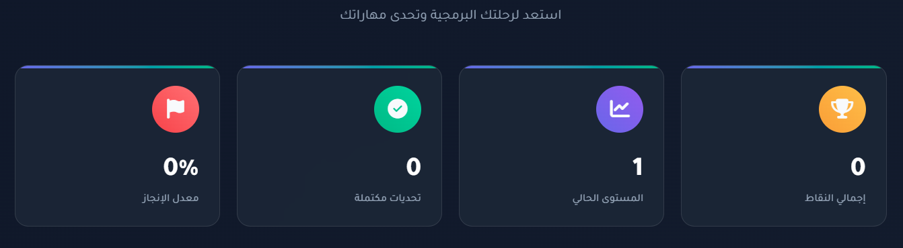
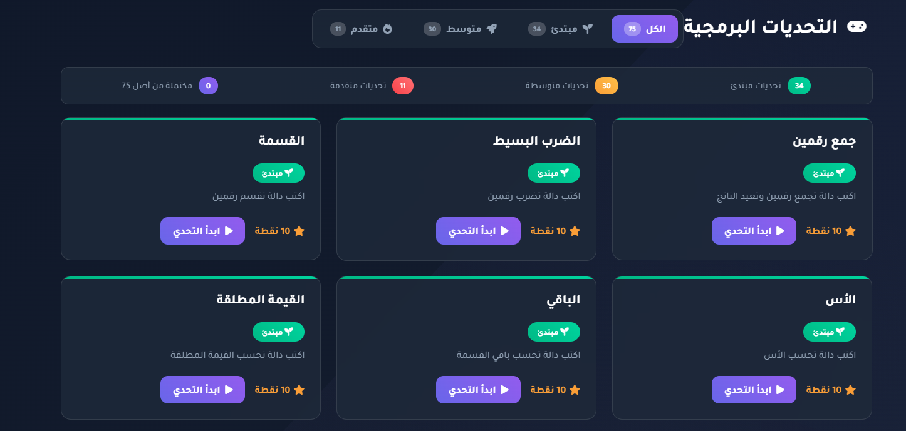
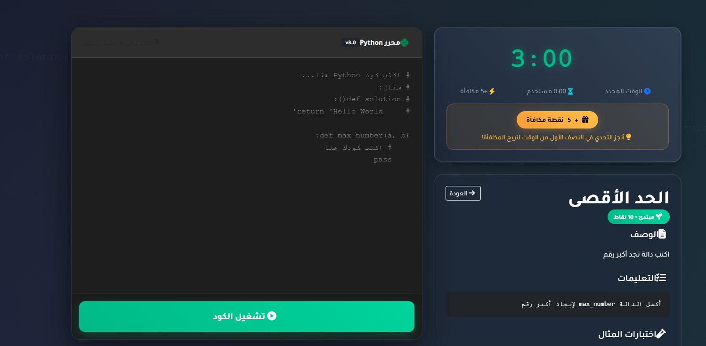

## About CodeChallenge

CodeChallenge is a Python challenge platform for developers and Python enthusiasts. It offers a variety of questions with different difficulty levels, where the goal is to analyze each question, answer as quickly as possible, and earn the highest score.

  

  

  

